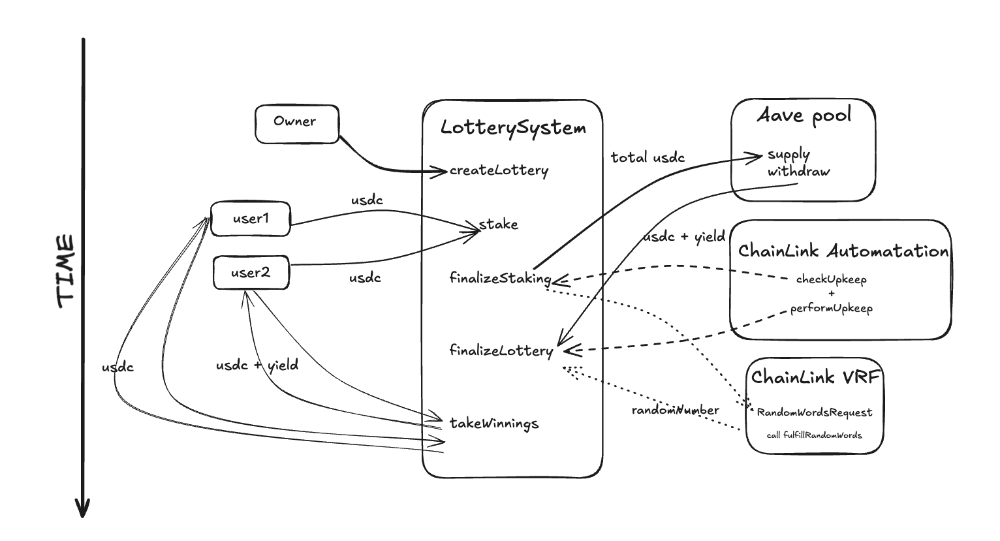

# NoLose Lottery System

A decentralized lottery system built on Ethereum that allows users to participate in lotteries using USDC tokens. The system integrates with Aave Protocol to generate yield from staked tokens, which is then distributed to the winner. User is required only to stake and withdraw tokens, because all other technique calls are ran by Chainlink Automatation

## Features

- **Full Coverage Tests**: See [experiment.md](./experiment.md) for more details
- **ERC20 Staking**: Users can stake USDC tokens (or other ERC20 tokens) to participate in lotteries
- **Aave Integration**: Staked tokens are automatically supplied to [Aave Protocol](https://app.aave.com/) to generate yield
- **Weighted Random Selection**: Winner selection is based on the amount of tokens staked
- **True Random Generation**: Random number generation is implemented by [VRF](https://docs.chain.link/vrf) from Chainlink
- **Time-Based Phases**: Separate staking and lottery phases with configurable durations, running by Chainlink [Automatation](https://docs.chain.link/chainlink-automation)
- **Stake and Recieve Prize**: Participate in lottery and withdrawl your tokens after the lottery deadline 


# Scheme



## Quick start

1. Clone the repository:
```bash
git clone git@github.com:W1tBlou/Nolose-lottery.git
cd Nolose-lottery
```

2. Install dependencies:
```bash
forge install
```

3. Create a `.env` file with the following variables:

```bash
ANVIL_RPC_URL=http://127.0.0.1:8545
ETH_RPC_URL=your_mainnetEth_rpc_url
SEPOLIA_RPC_URL=your_sepoliaEth_rpc_url

# Contract Addresses (Mainnet)
USDC_ADDRESS=0xA0b86991c6218b36c1d19D4a2e9Eb0cE3606eB48
AAVE_POOL_ADDRESS=0x87870Bca3F3fD6335C3F4ce8392D69350B4fA4E2

# Contract Addresses (Sepolia)
SEPOLIA_USDC_ADDRESS=0x94a9D9AC8a22534E3FaCa9F4e7F2E2cf85d5E4C8
SEPOLIA_MOCK_AAVE_POOL_ADDRESS=your_deployed_mock_aave
SEPOLIA_VRF_COORDINATOR_ADDRESS=0x9DdfaCa8183c41ad55329BdeeD9F6A8d53168B1B

# Deployment
OWNER_ADDRESS=flex
PRIVATE_KEY=flex
```


## Usage

1. **Creating a Lottery**:
   - Only the owner can create a new lottery
   - Specify duration and staking period
   - Lottery ID is automatically assigned

2. **Participating**:
   - Approve USDC (or ERC20 token) spending for the lottery contract
   - Stake USDC tokens during the staking period
   - Higher stake amount increases chances of winning

3. **Finalization**:
   - After staking period ends, tokens are supplied to Aave
   - After lottery period ends, winner is selected
   - Winner receives:
     - Original stake amount
     - Generated yield from Aave

## Security Features

- Time-based phase management
- Owner-only administrative functions
- Safe token transfer handling
- Aave integration error handling

## License

MIT


## Acknowledgments

We would like to express our gratitude to:

- **Anthropic** for their advanced language models that helped in code generation and documentation
- **Cursor.sh** for providing an excellent development environment that enhanced our productivity

Their tools and services were invaluable in the development of this project.
