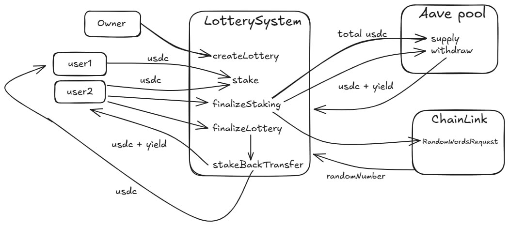

# Scheme


# NoLose Lottery System

## Acknowledgments

We would like to express our gratitude to:

- **Anthropic** for their advanced language models that helped in code generation and documentation
- **Cursor.sh** for providing an excellent development environment that enhanced our productivity

Their tools and services were invaluable in the development of this project.

 
A decentralized lottery system built on Ethereum that allows users to participate in lotteries using USDC tokens. The system integrates with Aave Protocol to generate yield from staked tokens, which is then distributed to the winner.

## Features

- **USDC Staking**: Users can stake USDC tokens to participate in lotteries
- **Aave Integration**: Staked tokens are automatically supplied to Aave Protocol to generate yield
- **Weighted Random Selection**: Winner selection is based on the amount of tokens staked
- **NFT Rewards**: Winners receive an NFT commemorating their win
- **Non-Reentrant Protection**: All critical functions are protected against reentrancy attacks
- **Time-Based Phases**: Separate staking and lottery phases with configurable durations

## Contract Architecture

The system consists of three main contracts:

1. **LotterySystem**: The main contract that manages the lottery process
   - Handles staking and unstaking
   - Integrates with Aave Protocol
   - Manages winner selection
   - Distributes rewards

2. **VotingPowerManager**: Manages voting power calculations
   - Handles token staking logic
   - Calculates voting power based on stake amount and duration

3. **VotingResultNFT**: ERC721 token contract for winner NFTs
   - Mints unique NFTs for lottery winners
   - Stores lottery result metadata
   - Generates on-chain metadata with lottery details

## Prerequisites

- Solidity ^0.8.20
- Foundry
- Node.js (for testing)
- Access to Ethereum network (mainnet or testnet)

## Installation

1. Clone the repository:
```bash
git clone https://github.com/yourusername/Nolose-lottery.git
cd Nolose-lottery
```

2. Install dependencies:
```bash
forge install
```

3. Create a `.env` file with the following variables:
```env
ETH_RPC_URL=your_ethereum_rpc_url
USDC_ADDRESS=0xA0b86991c6218b36c1d19D4a2e9Eb0cE3606eB48
AAVE_POOL_ADDRESS=0x87870Bca3F3fD6335C3F4ce8392D69350B4fA4E2
OWNER_ADDRESS=your_wallet_address
PRIVATE_KEY=your_private_key
```

## Testing

Run the test suite:
```bash
forge test -vv
```

## Deployment

1. Deploy to testnet (Sepolia):
```bash
forge script script/DeployVotingSystem.s.sol:DeployVotingSystem --rpc-url $SEPOLIA_RPC_URL --broadcast --verify -vvvv
```

2. Deploy to mainnet:
```bash
forge script script/DeployVotingSystem.s.sol:DeployVotingSystem --rpc-url $ETH_RPC_URL --broadcast --verify -vvvv
```

## Usage

1. **Creating a Lottery**:
   - Only the owner can create a new lottery
   - Specify duration and staking period
   - Lottery ID is automatically assigned

2. **Participating**:
   - Approve USDC spending for the lottery contract
   - Stake USDC tokens during the staking period
   - Higher stake amount increases chances of winning

3. **Finalization**:
   - After staking period ends, tokens are supplied to Aave
   - After lottery period ends, winner is selected
   - Winner receives:
     - Original stake amount
     - Generated yield from Aave
     - Unique NFT commemorating the win

## Security Features

- Reentrancy protection on all critical functions
- Time-based phase management
- Owner-only administrative functions
- Safe token transfer handling
- Aave integration error handling

## License

MIT

## Contributing

1. Fork the repository
2. Create your feature branch (`git checkout -b feature/amazing-feature`)
3. Commit your changes (`git commit -m 'Add some amazing feature'`)
4. Push to the branch (`git push origin feature/amazing-feature`)
5. Open a Pull Request

## Acknowledgments

- Aave Protocol for yield generation
- OpenZeppelin for secure contract patterns
- Chainlink for price feeds and randomness
